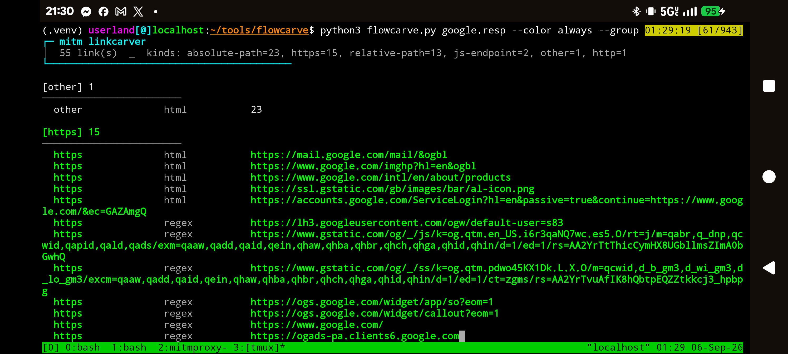
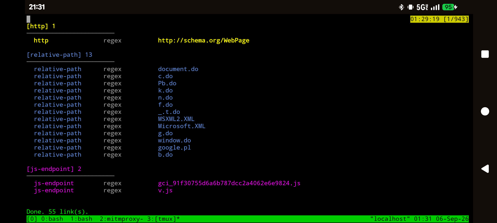

# flowcarve

Carve URLs and endpoints out of mitmproxy dumps, HAR exports, raw HTTP responses, and plain HTML / JS / JSON.

It walks response bodies and headers, classifies what it finds, prints a color-coded list, and can write the results to a file.

```bash
python3 flowcarve.py capture.mitm --unique --sort --group
python3 flowcarve.py response.txt --save links.txt
python3 flowcarve.py flows.har -o urls.json --format json
```
## Screenshots


## Features

- Reads mitmproxy flow dumps, HAR, raw `HTTP/1.x` response files, and generic text
- Pulls links from:
  - `Location`, `Link`, `Content-Location`, `Refresh`, and `X-Redirect` headers
  - HTML URL attributes (`href`, `src`, `action`, `srcset`, `ping`, meta refresh, URL-shaped `data-*`)
  - CSS `url()` and `@import`
  - JSON string values
  - Quoted paths and absolute `http`, `https`, `ws`, and `wss` URLs, including JavaScript `\/` and `\u002F` escapes
- Skips comments, JavaScript regex literals, namespace URLs, `javascript:` and `data:` URIs, MIME types, and ordinary `data-*` values
- URL-decodes encoded hits and keeps both forms
- Color output by link kind
- Dedup, sort, group, domain / substring / regex filters
- Resolve relative paths against the flow request URL
- Save as `.txt`, `.json`, or `.csv`

## Requirements

- Python 3.10+
- `mitmproxy` **only** if you want to parse native flow dumps (`mitmdump -w flows.mitm`)

```bash
python3 -m pip install -r requirements.txt
```

HAR files, raw responses (`export.file raw_response`), HTML, JS, and JSON work with the standard library alone. If you skip `mitmproxy` and feed the script a `.mitm` file, it will tell you to install it.

## Install

```bash
git clone <your-repo>
cd <your-repo>
python3 -m pip install -r requirements.txt
chmod +x flowcarve.py
```

Or just drop `flowcarve.py` somewhere on `PATH`.

## Supported inputs

| Input | How you get it | Needs mitmproxy? |
| --- | --- | --- |
| Flow dump | `mitmdump -w flows.mitm` or `save.file @all flows.mitm` | Yes |
| HAR | `save.har @all flows.har` | No |
| Raw response | In mitmproxy: `export.file raw_response @focus response.txt` | No |
| HTML / JS / JSON / text | Any saved body | No |
| stdin | `cat body.html \| python3 flowcarve.py -` | No (HAR and text only) |

The script sniffs the file: `.har` / JSON HAR, `.mitm` / `.flow` / `.dump`, raw `HTTP/` messages, or plain text.

## Usage

```text
python3 flowcarve.py [options] FILE [FILE ...]
```

### Common runs

```bash
# One exported response
python3 flowcarve.py response.txt --unique --sort --group

# Native dump, including the request URLs themselves
python3 flowcarve.py flows.mitm --include-requests --unique

# HAR → JSON report
python3 flowcarve.py capture.har -o urls.json --format json

# Quiet extract to a text file
python3 flowcarve.py dump.mitm --quiet --unique --save links.txt

# Only HTTPS and root-relative paths, resolved against the request URL
python3 flowcarve.py flows.mitm --kind https,absolute-path --resolve --group

# Domain + substring filter
python3 flowcarve.py flows.mitm --domain example.com --contains /api/

# Pipe a body
cat app.js | python3 flowcarve.py - --unique
```

### Flags

| Flag | What it does |
| --- | --- |
| `-o`, `--save FILE` | Write results to `FILE` |
| `--format txt\|json\|csv` | Output format (default: infer from extension, else `txt`) |
| `--include-requests` | Also keep each flow’s request URL |
| `--unique` | Deduplicate |
| `--sort` | Sort by kind, then URL |
| `--group` | Group color output by kind |
| `--resolve` | Join relative links to the flow request URL |
| `-v`, `--verbose` | Show flow URL and status next to each hit |
| `--kind LIST` | Keep only these kinds (comma-separated) |
| `--origin LIST` | Keep only these origins: `request`, `header`, `html`, `css`, `json`, `regex` |
| `--contains STR` | Keep links containing this substring |
| `--regex PATTERN` | Keep links matching this regex |
| `--domain LIST` | Keep links whose host matches (comma-separated) |
| `--color auto\|always\|never` | Color control (`auto` respects TTY / `NO_COLOR`) |
| `-q`, `--quiet` | Don’t print to stdout (use with `--save`) |

`python3 flowcarve.py -h` prints the same list.

## Link kinds

| Kind | Example |
| --- | --- |
| `https` | `https://api.example.com/v2/items` |
| `http` | `http://intranet.local/status` |
| `wss` / `ws` | `wss://realtime.example.com/socket` |
| `protocol-relative` | `//cdn.example.com/app.js` |
| `absolute-path` | `/api/v1/users` |
| `relative-path` | `../assets/app.css` |
| `js-endpoint` | `api/users.json`, `graphql` style paths |
| `mailto` | `mailto:ops@example.com` |

Origins (where the hit was found) are tagged separately: `header`, `html`, `css`, `json`, `regex`, `request`. URL-decoded copies get a `+decoded` suffix on the origin.

## Output files

`--save` / `-o` writes one of:

- **txt** — one URL per line (the resolved URL if `--resolve` is set)
- **json** — list of objects with `link`, `resolved`, `kind`, `origin`, `flow_url`, `status`, `content_type`, `source`
- **csv** — same columns as the JSON objects

Format is taken from `--format`, or from the file extension (`.json`, `.csv`), otherwise `txt`.

```bash
python3 flowcarve.py flows.mitm --unique --resolve -o urls.txt
python3 flowcarve.py flows.mitm --unique -o urls.json
python3 flowcarve.py flows.mitm --unique -o urls.csv
```

## Getting a file out of mitmproxy

Save everything while capturing:

```bash
mitmdump -w flows.mitm
```

Or from the interactive console:

```text
save.file @all flows.mitm
save.har  @all flows.har
export.file raw_response @focus response.txt
```

Then:

```bash
python3 flowcarve.py flows.mitm --unique --sort --group
python3 flowcarve.py response.txt --save links.txt
```

## Notes

- Image, font, audio, video, and other binary bodies are skipped. SVG, HTML, JS, JSON, CSS, and plain text are still scanned. A known binary suffix (`.png`, `.woff2`, `.pdf`, …) yields no links.
- Absolute URLs are kept from anywhere when the host looks real. Paths are kept from markup, CSS, JSON, and quoted strings, so a comment or a regex literal is not a link.
- Use `--kind`, `--origin`, `--contains`, or `--domain` to narrow a noisy capture.
- Schema and W3C namespace URLs, `javascript:`, and `data:` URIs are dropped.
- stdin does not accept native mitmproxy dumps. Pass those as a file path.
